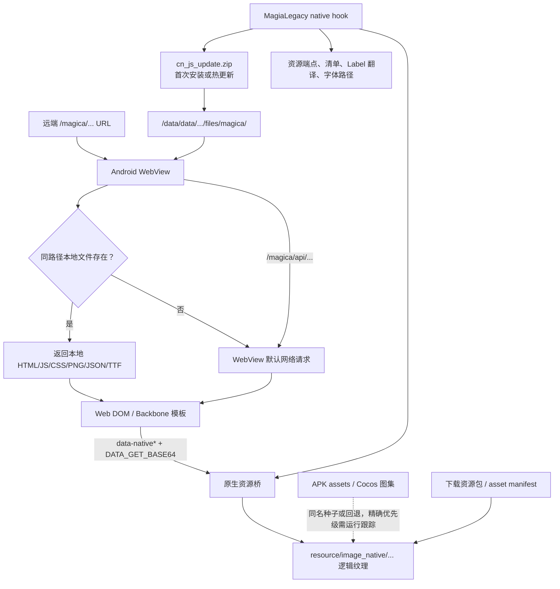

# MagirecoCN 图像资源双体系与 Totentanz `magica` 覆盖架构调查

调查日期：2026-08-06

## 1. 结论先行

**两套 ZIP 并不是“一个 APK 本地体系、一个网络 `magica` 体系”。**它们都是从同一版 `magirecocn-legacy-client` APK/反编译仓库提取出的同一批资源，只是交付形态不同：

| 输入 | 实际性质 | 是否属于 APK/原生资源提取 | 是否是网络 `magica/resource/image_web` 快照 |
|---|---|---:|---:|
| `magirecocn-images-complete.zip` | 561 个直接图片 + 997 个 plist 图集拆帧 + 基础报告 | 是 | 否 |
| `magirecocn-image-callgraph-l2d-reuse-final.zip` | 同一批 1,558 个图片 + 调用关系、源码证据、离线浏览器和复用建议 | 是 | 否 |
| 当前 `magireco-cn-patch/magica/` | CSS/HTML/JS/JSON、11 个 Web PNG 和 1 个字体；发布时打成 `cn_js_update.zip` | 不是上述 ZIP 的第二种呈现 | 是，但下载后又由本地 WebView 覆盖层提供 |

更准确的运行时模型是：

1. `magica/` 前端文件通过网络安装/热更新包送达；
2. 包被解压到应用私有目录 `/data/data/io.kamihama.totentanz/files/magica/`；
3. WebView 访问 `/magica/...` 时，**同路径本地文件存在就优先返回本地文件，不存在才继续默认网络请求**；`/magica/api/...` 明确不走本地文件覆盖；
4. Web HTML 还会通过 `data-nativeimgkey` / `data-nativebgkey` 和 `DATA_GET_BASE64` 向原生层请求 `resource/image_native/...` 纹理；
5. native hook 同时参与首次安装、资源端点、资源清单、引擎字符串和字体替换。

因此，APK 原生素材、下载到本地的 native 素材、`magica` Web 热更素材和远端 Web 回退之间有明确耦合，不能按“两套互不干涉的体系”处理。

## 2. 分析基准与可复现性

### 2.1 输入

| 输入 | 大小 | SHA-256 |
|---|---:|---|
| `A:\magirecocn-image-callgraph-l2d-reuse-final.zip` | 41,705,939 | `02abe9993826b34b6007e8c1bdde278d0f644f86ed8e612ae5b72c69ae438a6c` |
| `A:\magirecocn-images-complete.zip` | 43,190,503 | `0b63f6b7854cf2c8a0c104cb8f021d206550edbba4d5ef1d6b375ee8d21bdd90` |

两个 ZIP 内嵌报告都声明素材基准为：

`d9d7b2c81127c5d69612eeb26ee6afde43ab4a02`

本次另外检出的当前仓库快照：

| 仓库 | 提交 |
|---|---|
| `MagirecoCN-Revival-Project/magirecocn-legacy-client` | `8f6dba66ccf2d526a6ea2a60e73491af7d18b05f` |
| `HiiragiNemu/magireco-cn-patch` | `3c983a778429d5e56a2569aa28ea8c622d988c63` |

完整来源记录见 `artifacts/source_inventory.json`；可复现脚本是 `analyze_assets.py`。

## 3. 两套 ZIP 的逐文件对应结果

### 3.1 直接图片

- 两包各有 561 个直接图片；
- 561 个逻辑路径全部一一对应；
- 561 个文件全部字节级相同；
- 两边独有文件均为 0。

### 3.2 plist 图集拆帧

- 两包各有 997 个拆帧；
- 997 个逻辑路径全部一一对应；
- 954 个字节级相同；
- 2 个编码字节不同，但解码像素完全相同；
- 39 个尺寸或裁剪结果不同；
- 2 个尺寸相同但像素不同。

这 43 个非字节相同项只发生在**从 plist/texture 派生的拆帧产物**中。两包都明确指向同一源仓库、同一素材基准和相同的 997 个帧路径，因此这些差异应视作拆帧/裁剪输出差异，不能据此推导出第二套运行时网络资源体系。

逐文件证据：`artifacts/zip_asset_correspondence.csv`。

### 3.3 两包真正的差别

- `images-complete` 是完整图片提取和基础清单；
- `image-callgraph-l2d-reuse-final` 在同一批图像上加入 10,619 条静态调用/定义关系、229 个相关源码/配置、功能分类、L2D/Web 复用清单和离线浏览器；
- callgraph 包自身也声明：直接图片 561、图集帧 997、总素材 1,558，且属于静态逆向。
- 两边图片负载的命名空间统计也完全相同：87 条 `resource/image_native` 路径、0 条 `resource/image_web` 路径、0 个当前 Global Menu 图标 basename；见 `artifacts/zip_image_namespace_scan.json`。

所以它们是“**素材全集**”与“**同一素材全集的调用关系增强版**”，不是运行时的 native/Web 二分。

## 4. 实际运行架构与交叉点

### 4.1 WebView：本地覆盖与网络回退共用同一 URL 空间

实际打包树 `legacy-client/smali/jp/f4samurai/web/WebViewImpl$WebViewClientImpl.smali:80-98,101-183,255-313`，以及与其一致的可读反编译对照 `jadx-reference/sources/jp/f4samurai/web/WebViewImpl.java:86-129`，其 `shouldInterceptRequest` 明确执行：

1. URL 包含 `/magica/` 时截取后缀并移除查询串；
2. 非 `api/` 路径映射到 `/data/data/io.kamihama.totentanz/files/magica/<suffix>`；
3. 本地文件存在时按 PNG/JPEG/JSON/JS/CSS/HTML MIME 返回 `FileInputStream`；
4. 未命中则调用 `super.shouldInterceptRequest(...)`。

这直接证明：Web 前端不是“要么全本地、要么全网络”，而是同一路径命名空间中的本地优先覆盖层。

### 4.2 首次安装和热更新：网络到本地的转换

`CNDownloaderFix.java:61-111,656-684`：

- 文件根目录为 `/data/data/io.kamihama.totentanz/files`；
- 安装根目录为 `/data/data/io.kamihama.totentanz/files/`；
- 首两个包是 `cn_scenario_update.zip` 和 `cn_js_update.zip`；
- 还包括 native 基础包、`cn_magica_resource.zip`、剧情图、语音和影片等共 15 包；
- 下载后调用 `extractChecked(archive, INSTALL_ROOT)`。

`CNHotUpdateCheck.java:43-53,67-68,135-145,245-329`：

- 版本 JSON 与 ZIP 从网络获取；
- `cn_js_update.zip` 是“前端脚本”包；
- 临时包放在应用 `files/`；
- 校验后通过 `CNHotUpdateTx.apply(..., filesDir, ...)` 事务化换入，失败回滚。

`cn-patch/.github/workflows/sync-and-upload.yml:315-340` 则从发布侧确认：任何 `magica/` 变化会标记 JS 更新，并执行：

`zip -r cn_js_update_new.zip magica/`

所以“基于网络接收”描述的是**交付阶段**，“APK 私有目录本地控制”描述的是**更新后的运行阶段**；它们是同一条流水线的前后两段。

### 4.3 native hook：不是孤立的 APK 补丁层

`legacy-client/magia-native/src/MagiaLegacy.cpp` 的实际职责包括：

- `195-242`：调用 Java `RestClient.startCNDownload` 触发中文资源安装；
- `282-288`：构建 `/magica/resource`、asset master 和 scenario 资源端点；
- `386-411,1614-1658`：在资源未就绪时触发安装器，并 hook 资源清单/下载回调/资源端点；
- `1202-1222,1694-1724`：从 `/files/madomagi/engine_i18n.tsv` 热加载引擎硬编码文本翻译，并 hook Cocos Label 系列入口；
- `1458-1519,1726-1732`：把原生字体路径 `fonts/MTF4a5kp.ttf` 改为 `fonts/TTZhiHeiGB3-W4.ttf`。

它同时连接了原生引擎、网络资源端点、本地已安装状态、翻译表和字体，不应当视为与 `magica` Web 前端互不相干的体系。

### 4.4 Web 前端直接请求 native 纹理

`cn-patch/magica/js/_common/backboneCommon.js:3` 会扫描：

- `[data-nativeimgkey]`
- `[data-nativebgkey]`

并把元素的 `data-src` 组成 native 资源请求表。`nativeCommand.js:29` 的 `getBaseData` 再发送 `DATA_GET_BASE64`。

全树静态扫描得到：

- `resource/image_native/` 出现 400 次；
- 分布在 88 个 `magica` 源文件；
- 例如 `template/arena/ArenaConfirm.html:36-41,94` 直接请求属性框、星级框、卡面框和角色卡图。

清单：`artifacts/frontend_native_bridge_occurrences.csv`。

这说明 Web HTML 与 native/download asset 纹理不仅共享视觉内容，还存在正式调用桥。

## 5. 共享字体与共享纹理

### 5.1 字体是明确的跨层共享项

APK 侧 `assets/fonts/` 有 7 个文件；当前 Web 热更侧有：

`magica/fonts/TTZhiHeiGB3-W4.ttf`

它与 APK 中同名字体的 SHA-256 完全相同：

`01a4be2e5fca489c30219b3bec5edac0b7c98128c5fa629c34a0208ed5b0ba34`

文件大小均为 8,367,096 字节。

同时：

- `magica/css/_common/fonts.css:1-3` 通过 `/magica/fonts/TTZhiHeiGB3-W4.ttf` 提供 Web 字体；
- `MagiaLegacy.cpp:1489-1495` 把原生 `MTF4a5kp.ttf` 路径重定向到同名字体；
- `magica/js/_common/base.js:9-10` 仍保留 `motoya`、`mbm` 的 native base64 字体注入通道。

因此字体是已证实的物理文件复用与运行机制复用交叉点。详见 `artifacts/font_correspondence.csv`。

### 5.2 APK 与下载清单存在同路径纹理重叠

将 `legacy-client/assets` 的 391 个文件与 `cn-patch/asset_main_cn.json` 的 69,802 条下载项按逻辑路径比较：

- 同逻辑路径：59；
- 同 MD5：17；
- 不同 MD5：42；
- 其中图像同路径：40；
- 图像同 MD5：9；
- 图像不同 MD5：31。

可验证的同内容例子包括：

- `resource/image_native/bg/web/web_black.jpg`
- `resource/image_native/card/frame/att_dark.png`
- `resource/image_native/card/frame/att_light.png`
- `resource/image_native/card/frame/att_water.png`
- 多个 `frame_rank_*` 与背景框素材

同路径但内容不同的例子包括：

- `resource/image_native/card/frame/att_fire.png`
- `resource/image_native/card/frame/bg_light.png`
- `resource/image_native/card/image/card_10011_l.png`
- `resource/image_native/card/image/card_10011_m.png`
- 多个 `card_xxxxx_*`、`chara_xxxx_*`、`memoria_xxxxxx_*` 占位素材

这证明 APK 内置种子/占位资源与下载资源共享逻辑命名空间。仅靠静态仓库还不足以给出 Cocos 文件解析器对每条路径的最终搜索优先级；该部分应在设备上记录 `FileUtils::fullPathForFilename` 或等价加载点，不能把“同名”直接写成“必定由哪一侧覆盖”。完整清单：`artifacts/apk_vs_download_manifest.csv`。

## 6. Global Menu Web 图标调查

当前 `cn-patch/magica/resource/image_web/common/global/` 有 11 个 PNG：

| 文件 | 尺寸 | 当前 `common.css` 静态引用 | 两 ZIP 中同名 | APK 图片精确哈希副本 |
|---|---:|---:|---:|---:|
| `gacha_badge.png` | 104×46 | 否 | 无 | 无 |
| `gacha_badge_a.png` | 104×46 | 否 | 无 | 无 |
| `global_back.png` | 178×85 | 是 | 无 | 无 |
| `global_battle.png` | 352×382 | 是 | 无 | 无 |
| `global_gacha.png` | 208×246 | 是 | 无 | 无 |
| `global_memoria.png` | 208×246 | 是 | 无 | 无 |
| `global_mission.png` | 208×246 | 是 | 无 | 无 |
| `global_quest.png` | 352×382 | 是 | 无 | 无 |
| `global_shop.png` | 208×220 | 是 | 无 | 无 |
| `global_team.png` | 352×382 | 是 | 无 | 无 |
| `global_unit.png` | 208×246 | 是 | 无 | 无 |

结论：

- 两套 ZIP 均不包含 `resource/image_web/common/global`；
- 11 个文件均未在 ZIP 中找到同名项；
- 11 个文件均未与 APK 图片形成精确 SHA-256 匹配；
- 9 个 `global_*` 文件已被当前 `common.css` 静态引用；两个 `gacha_badge*` 当前未在该 CSS 中静态命中，可能由动态代码、其他版本或未来页面使用，需运行时网络/DOM 跟踪确认；
- `images-complete` 包自身也明确警告：没有可识别为 `mypage`、`home`、`mainmenu`、`globalmenu` 或 `bottommenu` 的原资源路径，不能把 APK 提取物武断认作正式首页导航图标全集。

逐图标哈希、尺寸和引用状态：`artifacts/global_menu_web_icons.csv`。

## 7. 对 Totentanz 中文注入工作的直接建议

1. **以当前 Totentanz `magica` 为结构基线。**保留当前 HTML 结构、新 CSS 和新 UI 图标，只按文件/选择器/字符串做定向中文覆盖；不要用旧国服 `magica` 整树替换。
2. **Web 中文化内容进入 `magica/` 热更包。**HTML、JS、CSS、Web PNG、JSON 和 Web 字体应维持 `/magica/...` 路径，使现有 WebView 本地优先机制自然接管。
3. **native 资源不要伪装成 `image_web`。**旧 APK 的 plist 拆帧是分析/复用派生物；若原生层仍按 plist、ExportJson、帧名和 Cocos 时间轴加载，应保留原图集语义或通过正式 native 下载包发布。
4. **只在明确需要 Web 重制时复制拆帧。**复制到 Web 时应使用独立命名空间并记录源 plist、frame rect、rotation、offset、original size；避免与当前 `global_*` 文件同名覆盖。
5. **为每个覆盖文件记录四种来源角色：**`web_local_override`、`web_network_fallback`、`native_download_asset`、`apk_seed_or_fallback`。同名冲突必须以设备实测的最终解析路径为准。
6. **测试矩阵至少覆盖：**首次安装在线、热更新在线、断网但本地 `magica` 完整、删除单个本地 Web 文件后的网络回退、native base64 卡图加载、字体在 Web 与 Cocos Label 两侧渲染、更新失败事务回滚。
7. **Global Menu 图标按 Web 资产维护。**当前证据支持它们属于 `magica/resource/image_web` 前端层，而不是两套 APK 提取 ZIP 中的 atlas/native 图标；除非后续运行跟踪得到同帧复用证据，不应把 APK 拆帧批量覆盖到该目录。

## 8. 证据边界

- atlas frame PNG 是从原纹理/`plist` 派生的便利文件，不代表 APK 运行时一定以独立 PNG 路径读取；回包或移植时必须保留图集元数据语义。
- 本报告对 WebView、本地安装、热更新、DOM-native bridge、字体 hook 的结论来自明确源码控制流，置信度高。
- APK assets 与下载清单的同名重叠已确认，但 native 文件搜索顺序尚未通过真机函数跟踪确认。
- “未找到静态引用”不等于运行时不用；服务器 JSON、动态字符串、数字 ID 和原生二进制都可能间接选择资源。
- 当前仓库提交晚于两个 ZIP 的内嵌素材基准，因此报告把“ZIP 内容身份”和“当前发布/运行机制”分开记录，没有把时间差误判成第二套资源体系。

## 9. 产物索引

| 文件 | 用途 |
|---|---|
| `analyze_assets.py` | 可复现的逐文件扫描与比较脚本 |
| `artifacts/analysis_summary.json` | 机器可读总计 |
| `artifacts/source_inventory.json` | 输入哈希、仓库提交和干净状态 |
| `artifacts/zip_asset_correspondence.csv` | 两 ZIP 的 1,558 条逐资源对应关系 |
| `artifacts/zip_image_namespace_scan.json` | 两 ZIP 图片负载的 native/Web 路径命名空间计数 |
| `artifacts/apk_vs_download_manifest.csv` | APK 与下载清单的同路径比较 |
| `artifacts/frontend_local_images.csv` | 当前前端 11 个 PNG 与 APK 哈希对照 |
| `artifacts/global_menu_web_icons.csv` | Global Menu 图标路径、尺寸、哈希和引用状态 |
| `artifacts/font_correspondence.csv` | APK/Web 字体哈希对照 |
| `artifacts/frontend_resource_references.csv` | `/magica/...` Web URL 静态引用清单 |
| `artifacts/frontend_native_bridge_occurrences.csv` | 400 处 native 资源桥引用 |
| `artifacts/evidence_index.csv` | 结论到源码/行号/清单的证据索引 |
| `artifacts/SHA256SUMS.txt` | 报告、脚本和机器可读产物的完整性校验 |
